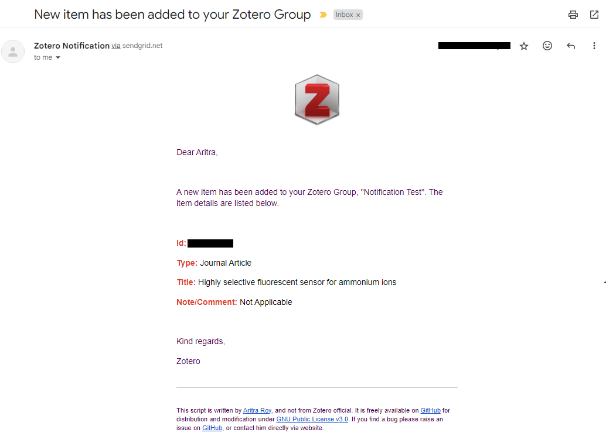

# [Zotero Email Notification Automation](https://github.com/aritraroy24/zotero-notification)


## What Is This Project About?
This project is an automated system for sending email notifications about Zotero updates [done by other users]. It uses a PHP script hosted on 000webhost and a GitHub Actions workflow for scheduling.

## Screenshot of the Email Notification

## Table of Contents

- [What Is This Project About?](#what-is-this-project-about)
- [Screenshot of the Email Notification](#screenshot-of-the-email-notification)
- [What Is Zotero?](#what-is-zotero)
- [Requirements](#requirements)
- [How to Host the PHP Script on 000webhost](#how-to-host-the-php-script-on-000webhost)
  - [Preparing the Required Zip File](#preparing-the-required-zip-file)
  - [Creating Account on 000webhost & Uploading the Zip File](#creating-account-on-000webhost--uploading-the-zip-file)
  - [Unzipping the Zipped File](#unzipping-the-zipped-file)
- [Setting up Authentication & Automation](#setting-up-authentication--automation)
  - [Creating the .env file](#creating-the-env-file)
  - [Getting the Zotero API Key & User ID](#getting-the-zotero-api-key--user-id)
  - [Getting the SendGrid API Key](#getting-the-sendgrid-api-key)
  - [Setting up GitHub Actions](#setting-up-github-actions)
- [License](#license)
- [Contributing](#contributing)
  - [Pull Request Process](#pull-request-process)
- [Issues](#issues)
- [Maybe A Star?](#maybe-a-star)
- [Contact](#contact)

## What Is Zotero?

Zotero is a free, open-source reference management software that helps you collect, organize, cite, and share research. It's easy to use, connects with your web browser to download sources, and helps you create bibliographies in multiple formats. Whether you're a student, researcher, or scientist, Zotero simplifies the task of managing and organizing research materials.

## Requirements    
PHP 5.3 and newer
(If you still run PHP < 5.6 you should consider updating PHP. These old PHP versions do not get any security updates and your site may be vulnerable.)

## How to Host the PHP Script on 000webhost

#### Preparing the Required Zip File

1. Navigate to the [repository](https://github.com/aritraroy24/zotero-notification).
2. Click on the "Fork" button at the top right corner to create a copy of the repository in your GitHub account.
3. Once the repository is forked, you can download it as a zip file or clone it:

   ##### Download as ZIP
   1. On the main page of the forked repository in your account, click on the "Code" button and then "Download ZIP" to download the repository as a zip file.
   2. Extract the zip file in a new folder.

   ##### Clone the Repository
   1. On the main page of the forked repository in your account, click on the "Code" button.
   2. Copy the URL under "Clone with HTTPS".
   3. Open your terminal, navigate to the directory where you want to clone the repository, and run the following command:

        ```bash
        git clone <copied-url>
        ```
4. Navigate to the directory of the cloned repository in your terminal and run `composer install`.
```bash
cd zotero-notification # or whatever the name of the extracted folder is
composer install
```
 - If you don't have composer installed, you can download it from [here](https://getcomposer.org/download/).
5. It should create a new folder named *vendor* with all the dependencies installed.
6. After the installation is complete, modify the email template with your name on line number *164* of the file `email_template.twig`.
7. Finally, create a new zip file with all the contents of the new folder *(zotero-notification-main.zip)*.


#### Creating Account on 000webhost & Uploading the Zip File

1. Sign up for a free account on [000webhost](https://www.000webhost.com/).
2. In the 000webhost dashboard area, click "Create a new website" and set your website *\(your-zotero-website.000webhostapp.com)* name and password.
3. For later reference, the username for your website will be *your-zotero-website* and password will be the same which you set in the previous step.
4. Select the *Upload site* option to upload your new zip file in the `public_html` folder.

#### Unzipping the Zipped File

1. Download the `.editorconfig` and `unzipper.php` files from [github.com/ndeet/unzipper](https://github.com/ndeet/unzipper).

2. Upload the `.editorconfig` and `unzipper.php` files to the `public_html` folder.

3. Navigate to `your-website.000webhostapp.com/unzipper.php` in your web browser.

4. Select the zip file you uploaded and click "Unzip Archive".

5. After the files have been unzipped, delete the `.editorconfig`, `unzipper.php` and the `zotero-notification-main.zip` files from your `public_html` folder.

6. Navigate to the `zotero-notification-main` folder inside your `public_html` folder and move all the files from this folder to the `public_html` folder.

7. Delete the `zotero-notification-main` folder.

For more visualized information, refer to this [000webhost forum thread](https://www.000webhost.com/forum/t/how-to-unzip-files-using-unzipper/51626).

## Setting up Authentication & Automation

#### Creating the .env file

1. In the `public_html` folder of your 000webhost site, create a new file named `.env`.
2. Open the `.env` file and set your environment variables in the format `VARIABLE_NAME=value`. For example:

```properties
ZOTERO_API="your_zotero_api_key"
ZOTERO_USERID="your_zotero_user_id"
SENDGRID_API_KEY="your_sendgrid_api_key"
FROM_EMAIL="your_email_address"
TO_EMAIL="the_email_address_to_send_notifications_to"
```

- Change the `FROM_EMAIL` and `TO_EMAIL` values to the email addresses you want to send the notifications from and to, respectively.

#### Getting the Zotero API Key & User ID

1. When logged in to your Zotero account, navigate to the "*Settings*" section in the topbar menu, and then "*Feeds/API*" to create a new API key.
2. You can find your `userID` in this section itself. Copy the `userID` and paste it into your `.env` file as the value for `ZOTERO_USERID`.
3. Click "*Create new private key*" (API key), give description and set the permissions and save the key. Finally, copy it into your `.env` file as the value for `ZOTERO_API_KEY`.

#### Getting the SendGrid API Key

1. Sign up for a free account on [SendGrid](https://sendgrid.com/).
2. After logging in, navigate to the "*Sender Authentication*" section in the left-hand menu, and then "*Verify a Single Sender*" to create a new sender using your email address from which you want to send the notifications.

3. After verification, navigate to the "Email API" section in the left-hand menu.

4. Click on "Integration Guide".

5. Choose "Web API" as your email send method and click on "Next" to choose PHP as your preferred language".

6.  Give your API key a name, and click on "Create Key".

7. Copy the API key and paste it into your `.env` file as the value for `SENDGRID_API_KEY`.

Remember to keep your API key secure and do not share it with anyone.


#### Setting up GitHub Actions

1. In your GitHub repository, navigate to the "Actions" tab.

2. Click on "New workflow".

3. Click on "set up a workflow yourself".

4. Paste the following YAML script into the editor:

```yaml
name: Scheduled Workflow
on:
  schedule:
    - cron: '0 */3 * * *' # runs every 3 hours
jobs:
  build:
    runs-on: ubuntu-latest
    steps:
    - name: Run a one-line script
      run: curl https://zotero-notify.000webhostapp.com/index.php
```
5. Click on "Commit changes".

6. Enter a commit message, choose to commit directly to the `main` branch and hit "Commit changes" again.

## License

This project is licensed under the GPL v3 License. See the [LICENSE](LICENSE.md) file for details.

## Contributing

Contributions are welcome! Please feel free to submit a Pull Request. For more details about how to contribute, please refer to the [CONTRIBUTING.md](CONTRIBUTING.md) file.

#### Pull Request Process

1. Fork the repository and create your branch from `main`.
2. If you've added code that should be tested, add tests.
3. Ensure the test suite passes.
4. Make sure your code lints.
5. Issue that pull request!

## Issues

If you find a bug or have a question about the specific behavior of this project, please file an issue in the [Issues](https://github.com/aritraroy24/zotero-notification/issues) section.

---
## Maybe A Star?

If you find this project useful, please consider giving it a star on GitHub. This helps others discover it and motivates the maintainers.

## Contact


If you have any questions or doubts, feel free to reach out at [aritraroy.live](https://aritraroy.live) or sending an email to [contact@aritraroy.live](mailto:contact@aritraroy.live)